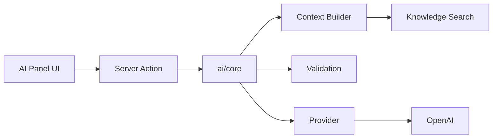

# AI Module Guide

Unified AI architecture for Auroranexis Release Candidate.

## Modules

| Module | Route / context | Purpose |
|--------|-----------------|---------|
| Report Copilot | Report detail | Draft and refine report content |
| Operational AI | Dashboard / ops | Operational insights and summaries |
| Risk AI | Risk detail | Risk analysis assistance |
| Incident AI | Incident detail | Incident response guidance |
| Client Success | Client success views | Client health narratives |
| Automation Builder | Automation center | Workflow suggestions |
| Knowledge Hub | `/knowledge` | Search, articles, playbooks, org memory |

## Architecture



Shared core: `src/lib/ai/core/`

- `errors.ts` — Normalized error codes for UI
- `validation.ts` — Output schema validation
- `observability.ts` — Metrics and diagnostics snapshot
- `retry.ts`, `history.ts`, `prompts.ts`

Shared UI: `src/components/ai/`

- Error alerts, empty states, upgrade cards, usage, history, diff preview, progress

## Provider configuration

Server-only environment:

```
AI_PROVIDER=openai
OPENAI_API_KEY=sk-...
OPENAI_MODEL=gpt-4o-mini
```

Provider resolution: `src/lib/ai/providers/`. Never use `NEXT_PUBLIC_` for AI keys.

## Plan gating

Each module checks plan features before execution (e.g. `ai_report_assistant`, `ai_knowledge_search`). Locked modules show `AIUpgradeCard` with consistent copy.

## Knowledge integration

Copilots inject organizational knowledge snippets via `searchKnowledgeForReport` / operational equivalents. Knowledge Hub maintains articles and playbooks scoped to the organization.

## Error handling

All actions return normalized errors via `toAIActionError()`. UI displays `AIErrorAlert` with retry where appropriate.

Standard codes include: quota exceeded, plan locked, validation failed, provider timeout, cancelled.

## Observability

**Settings → Diagnostics → AI Diagnostics** shows:

- Resolved provider and model
- API key presence (not value)
- Feature allowance and usage summary
- Core observability snapshot

## Developer documentation

Detailed docs in `docs/ai/`:

- [ARCHITECTURE.md](./ai/ARCHITECTURE.md)
- [FLOW.md](./ai/FLOW.md)
- [ERROR_FLOW.md](./ai/ERROR_FLOW.md)
- [SHARED_COMPONENTS.md](./ai/SHARED_COMPONENTS.md)

## Testing AI locally

1. Set `OPENAI_API_KEY` in `.env.local`
2. Use `DEV_FORCE_PLAN=professional` to unlock features without Stripe
3. Verify usage counters in diagnostics after generation

## Related

- [security.md](./security.md)
- [architecture.md](./architecture.md)
