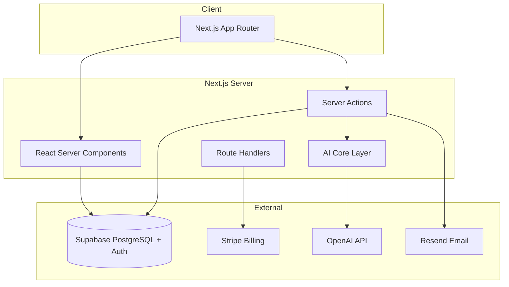

# Auroranexis Architecture

Production architecture overview for the Release Candidate (v0.1.0).

## System overview

Auroranexis is a multi-tenant SaaS platform for AI automation agencies. Each **organization** is isolated at the database layer via Supabase Row Level Security (RLS). Users authenticate through Supabase Auth; authorization is enforced server-side through RBAC and plan features.

## Application layers

| Layer | Location | Responsibility |
|-------|----------|----------------|
| Routes & layouts | `src/app/` | App Router pages, layouts, loading/error boundaries |
| UI components | `src/components/` | Aurora design system, feature panels, shared AI UI |
| Server libraries | `src/lib/` | Data access, billing, plans, RBAC, AI, diagnostics |
| Types | `src/types/` | Database and domain TypeScript types |

### Route groups

- `(auth)` — Login, signup, password flows
- `(dashboard)` — Authenticated workspace (clients, risks, incidents, reports, automation, knowledge, settings)
- `(portal)` — Client-facing portal (scoped to client records)
- API routes — Stripe webhooks, health checks

## Multi-tenancy

Every authenticated request resolves an **organization context** from the user's membership. Queries use the Supabase server client with the user's JWT so RLS policies enforce org isolation. Server-only service role access is limited to bootstrap and webhook paths.

## Plans & billing

Plan resolution combines Stripe subscription state with feature flags in `src/lib/plans/`. Checkout and customer portal use Stripe; feature gates are checked in server actions before sensitive operations.

## AI architecture

AI modules share a unified core in `src/lib/ai/core/`:

- Error normalization (`toAIActionError`)
- Output validation and observability
- Provider abstraction (`src/lib/ai/providers/`)
- Context builders per module (report, operational, risk, incident, knowledge)

Detailed AI documentation: [docs/ai.md](./ai.md) and [docs/ai/ARCHITECTURE.md](./ai/ARCHITECTURE.md).

## Observability

Workspace diagnostics (`/settings/diagnostics`) expose plan source, permissions, AI readiness, Stripe env presence, and platform health (build version, database latency, cache status). Secrets are never displayed—only presence flags and safe previews.

## Key design principles

1. **Server-first** — Sensitive logic and AI calls run on the server only.
2. **RLS as the security boundary** — Client never trusts org IDs from the browser alone.
3. **Plan-gated features** — AI and premium modules check plan features before execution.
4. **Aurora UI consistency** — Shared primitives (`PageSurface`, `PageHeader`, `Button`, etc.) across all modules.

## Related documentation

- [Deployment](./deployment.md)
- [Security](./security.md)
- [Database](./database.md)
- [Testing](./testing.md)
- [Release notes](./release-notes.md)
