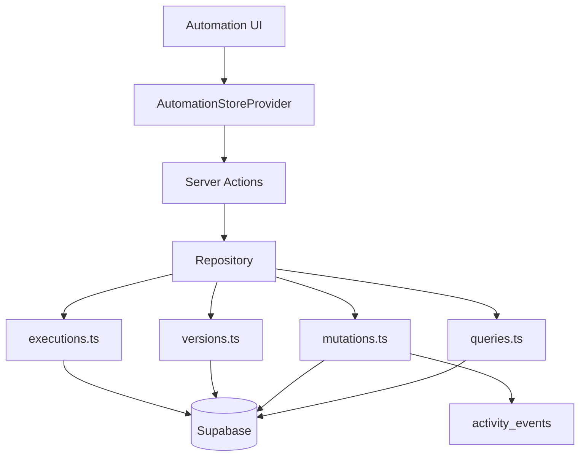
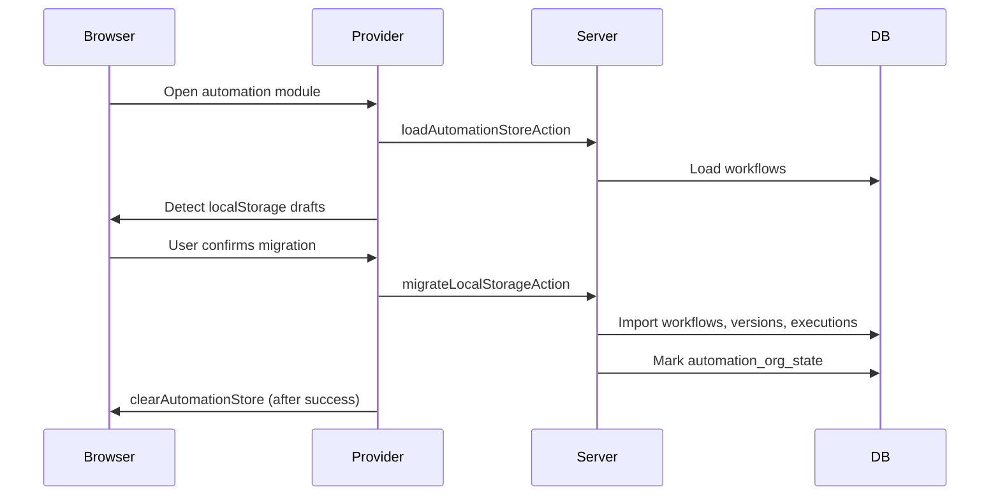

# Enterprise Workflow Persistence

Phase 4 Sprint 0 — production persistence foundation for the AI Automation Builder.

## Overview

User-defined workflows previously lived in browser `localStorage`. They now persist in Supabase with organization-scoped RLS, immutable versioning, and execution history.

## Architecture

| Layer | Path | Role |
|-------|------|------|
| UI | `src/components/automation/*` | Unchanged UX — same store API |
| Client bridge | `automation-store-provider.tsx` | Optimistic updates + server actions |
| Server actions | `src/lib/automation/storage/actions.ts` | Auth, plan gates, error normalization |
| Repository | `src/lib/automation/storage/repository.ts` | Public server API |
| Storage modules | `queries`, `mutations`, `versions`, `executions`, `validation` | No direct Supabase from UI |

## Database schema

### `automation_workflows`

Current workflow row plus denormalized metadata and full `workflow_json`.

| Column | Purpose |
|--------|---------|
| `organization_id` | Tenant isolation |
| `status` | `draft`, `active`, `paused`, `disabled`, `archived` |
| `version` | Current version number |
| `workflow_json` | Full `WorkflowDefinition` payload |
| `created_by`, `updated_by` | Audit |

### `automation_workflow_versions`

Immutable snapshots — **never overwritten**. Every save appends a version row.

### `automation_executions`

Simulation and future live execution history.

| Column | Purpose |
|--------|---------|
| `trigger` | Trigger type or label |
| `status` | `running`, `completed`, `failed`, `cancelled`, `simulation`, `partial` |
| `execution_log` | JSON: actions, errors, workflow name |
| `simulated` | Distinguishes simulation from future live runs |
| `initiated_by` | User or system identifier |

### `automation_execution_steps`

Ordered step log per execution (simulation steps today).

### `automation_webhooks`

Org-scoped webhook registry for future execution engine (Business+).

### `automation_org_state`

Tracks `local_storage_migrated_at` for migration diagnostics.

## Repository API

All methods require a authenticated `SessionContext` and enforce org scope:

- `createWorkflow` / `updateWorkflow` / `deleteWorkflow`
- `archiveWorkflow` / `restoreWorkflow`
- `getWorkflow` / `listWorkflows`
- `getWorkflowVersion` / `listVersions` / `restoreWorkflowFromVersion`
- `createExecution` / `appendExecutionStep` / `completeExecution` / `listExecutions`
- `recordSimulationExecution`
- `createWebhook` / `listWebhooks`
- `loadAutomationStore` — full store for UI hydration
- `migrateLocalStorageStore` — one-time import
- `getAutomationRepositoryDiagnostics`

## Execution model

### Workflow lifecycle (DB)

`draft` → `active` → `paused` → `disabled` → `archived`

Current UI continues to use `draft`, `active`, `disabled` only.

### Execution lifecycle (DB)

`running` → `completed` | `failed` | `cancelled` | `partial` | `simulation`

Future execution engine will reuse these states.

## Versioning

1. User saves workflow in builder
2. `updateWorkflowRecord` validates JSON (Zod)
3. Updates `automation_workflows`
4. Inserts into `automation_workflow_versions` (never overwrite)
5. Records activity events: `automation_workflow_updated`, `automation_workflow_versioned`

Restore creates a **new** version from a snapshot (increment version, append row).

## Migration flow

- Migration is **offered**, never silent
- Local data cleared **only after successful import**
- Failed migration leaves localStorage intact

## Plan limits

Enforced server-side in `assertServerAutomationLimit`:

| Plan | Limit |
|------|-------|
| Professional | 5 |
| Business | 25 |
| Enterprise | Unlimited |

Counts workflows with status `draft`, `active`, or `paused`.

## Security

- RLS on all automation tables via `current_organization_id()`
- Writes: owner/admin/staff (delete: owner/admin only)
- Webhooks: owner/admin only
- Workflow JSON validated with Zod before every save
- Webhook secrets stored server-side; never returned in list views
- No component accesses Supabase directly

## Observability

Activity events:

- `automation_workflow_created|updated|deleted|archived|restored|versioned`
- `automation_workflow_simulated`
- `automation_execution_finished|failed`
- `automation_local_storage_migrated`
- `automation_webhook_created`

Diagnostics (`/settings/diagnostics` → Automation persistence):

- Workflow, draft, execution, version, webhook counts
- Storage backend, repository status, DB latency
- Migration status

## Enterprise Workflow Engine v1

Phase 4 Sprint 1 adds live execution in `src/lib/automation/engine-v2/`:

- **Dispatcher** — matches platform events to active workflows
- **Executor** — conditions → actions → execution log + steps
- **Manual run** — owner/admin via `workflows/manage` on active workflows
- **Idempotency** — `trigger_hash` prevents duplicate runs for the same event

Platform events flow through `dispatchAutomation()` which also invokes the v2 engine via `fireWorkflowEngineFromAutomationEvent`. Client/report events call `fireWorkflowEngine` directly.

Engine version: **v1** (inline execution, no external queue).

## Future execution engine

This sprint provides **persistence only**. The separate server `Automation Engine` (`src/lib/automation/engine.ts`) remains for hardcoded operational triggers.

Phase 4+ will:

1. Match builder triggers to live events
2. Execute actions server-side using `automation_executions` + steps
3. Use `automation_webhooks` for external integrations

## Related

- [architecture.md](./architecture.md)
- [database.md](./database.md)
- [security.md](./security.md)
