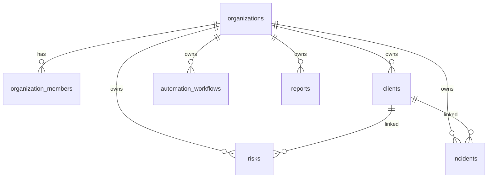

# Database Guide

PostgreSQL on Supabase — schema, isolation, and operational notes.

## Overview

- **Provider:** Supabase (PostgreSQL)
- **Migrations:** Applied via Supabase CLI / dashboard
- **Isolation:** Organization-scoped RLS on all tenant tables

Detailed entity design: [03_DATABASE_BLUEPRINT_V1.md](./03_DATABASE_BLUEPRINT_V1.md).

## Multi-tenancy



Every tenant table includes `organization_id`. RLS policies compare `organization_id` to the user's membership via helper functions or subqueries.

## Key tables

| Domain | Tables |
|--------|--------|
| Identity | `organizations`, `organization_members`, `users` |
| Clients | `clients`, client health / activity |
| Automation | `automation_workflows`, `automation_workflow_versions`, `automation_executions`, `automation_execution_steps`, `automation_webhooks`, `automation_org_state` |
| Operations | `risks`, `incidents` |
| Reporting | `reports`, templates, schedules |
| Billing | `organization_subscriptions` |
| AI / Knowledge | knowledge articles, playbooks (org-scoped) |

## Indexes & performance

- Foreign keys on `organization_id` and common join columns
- List pages use paginated queries with explicit `select` columns
- Avoid N+1: prefer joined selects or batched queries in `src/lib/*/queries.ts`

## RLS policies

Policies enforce:

1. **SELECT** — user must be member of the row's organization
2. **INSERT/UPDATE/DELETE** — member with sufficient role (where applicable)

Service role bypasses RLS — restrict to server-only code paths.

## Cascades

- Deleting an organization should cascade or block based on migration definitions
- Client deletion behavior is defined per related table in migrations

Verify cascade rules before bulk deletes in production.

## Migrations

- No breaking migrations in RC sprint
- Forward-only changes preferred
- Test migrations against a staging Supabase project before production

### Automation persistence (required for `/automation`)

Apply these migrations to the Supabase project referenced by `NEXT_PUBLIC_SUPABASE_URL`:

| Version | File | Purpose |
|---------|------|---------|
| `20250623330000` | `supabase/migrations/20250623330000_automation_workflows.sql` | Creates all six `automation_*` tables, RLS, grants |
| `20250623340000` | `supabase/migrations/20250623340000_automation_engine_v1.sql` | Engine v1 columns and extended execution statuses |

```bash
supabase login
supabase link --project-ref <your-project-ref>
supabase db push
```

Verify with `supabase/scripts/verify_automation_schema.sql`.

If PostgREST reports `Could not find the table 'public.automation_workflows' in the schema cache` **after** the tables exist, reload the API schema cache:

```sql
NOTIFY pgrst, 'reload schema';
```

On hosted Supabase you can also use **Project Settings → API → Reload schema** (or restart the project) if `NOTIFY` alone does not clear the cache.

## Health check

Platform diagnostics run a lightweight query:

```sql
SELECT id FROM organizations LIMIT 1;
```

Latency and connectivity are reported in **Settings → Diagnostics → Platform health**.

## Backup & recovery

Use Supabase point-in-time recovery (plan-dependent) for production. Export critical org data before major schema changes.

## Related

- [security.md](./security.md)
- [03_DATABASE_BLUEPRINT_V1.md](./03_DATABASE_BLUEPRINT_V1.md)
