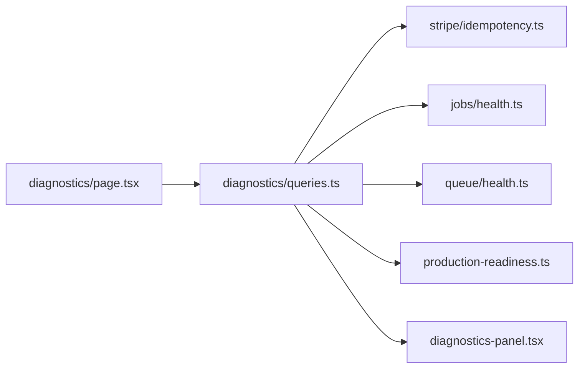

# Diagnostics Report — Phase 5 Sprint 0 (Updated)

**Date:** 2025-06-27  
**Sprint:** Phase 5 Sprint 0 — Production Infrastructure  
**Location:** Settings → Diagnostics (`/settings/diagnostics`)  
**Access:** Owner and admin roles only

---

## Summary

The workspace diagnostics panel aggregates platform health for operators. Phase 5 Sprint 0 adds four infrastructure sections — **Stripe webhooks**, **Cron infrastructure**, **Queue infrastructure**, and **Production readiness** — backed by server-side queries in `src/lib/diagnostics/queries.ts` and composite scoring in `src/lib/diagnostics/production-readiness.ts`.

No secret values are displayed; only presence flags, counts, timestamps, and status labels.

---

## Data flow



`getWorkspaceDiagnostics(session)` parallel-fetches all snapshots, computes `productionReadiness`, and returns `WorkspaceDiagnostics`.

---

## New sections (Phase 5)

### Stripe webhooks

**Source:** `getStripeWebhookDiagnostics()` in `src/lib/stripe/idempotency.ts`  
**UI description:** "Idempotent webhook processing — event IDs deduplicated, retries safe."

| Field | Type | Meaning |
|-------|------|---------|
| Events table reachable | boolean | `stripe_webhook_events` query succeeds |
| Processed events | count | Rows with `status = 'processed'` |
| Duplicates prevented | count | Rows with `status = 'duplicate'` |
| Failed events | count | Rows with `status = 'failed'` |
| Retry count | sum | Sum of `retry_count` across all rows |
| Last webhook received | timestamp | Most recent `received_at` |
| Last event type | string | `event_type` from most recent row |

**Validation:**

1. Send Stripe test webhook → processed count +1, last timestamp updates.
2. Replay event → duplicates prevented +1.
3. If table missing (migration not applied) → table reachable = false, all counts 0.

---

### Cron infrastructure

**Source:** `getCronDiagnosticsSnapshot()` in `src/lib/jobs/health.ts`  
**UI description:** "Registered background jobs, execution history, and schedule health."

| Field | Type | Meaning |
|-------|------|---------|
| Tables reachable | boolean | `job_definitions` probe succeeds |
| Registered jobs | number | Count from code registry (8) |
| Enabled jobs | number | DB rows with `enabled = true` |
| Failed jobs (24h) | count | `job_executions` failed since 24h ago |
| Average duration | ms | Mean of completed executions (last 100, 24h window) |
| Next run | timestamp | Earliest `next_run_at` across schedules |
| Last run | timestamp | Most recent `last_run_at` across schedules |
| Queue backlog | count | Pending `queue_jobs` (cross-link to queue health) |
| Status | enum | `healthy` · `degraded` · `unavailable` |
| Per-job list | array | Name, enabled, last status per registered job |

**Status thresholds:**

| Status | Condition |
|--------|-----------|
| `healthy` | Failed jobs (24h) ≤ 5 |
| `degraded` | Failed jobs (24h) > 5 |
| `unavailable` | Failed jobs (24h) > 20 OR tables unreachable |

**Validation:**

1. Run `/api/cron/run` → last run updates, per-job last status = `completed`.
2. Force failing job (staging) → failed jobs (24h) increments, status may degrade.

---

### Queue infrastructure

**Source:** `getQueueDiagnosticsSnapshot()` in `src/lib/queue/health.ts`  
**UI description:** "Background queue workers — retries, dead letters, and processing metrics."

| Field | Type | Meaning |
|-------|------|---------|
| Tables reachable | boolean | `queue_jobs` probe succeeds |
| Jobs pending | count | `status = 'pending'` |
| Jobs running | count | `status = 'running'` |
| Jobs failed | count | `status = 'failed'` |
| Jobs retried | count | Rows with `attempts > 1` |
| Dead letters | count | Rows in `queue_dead_letters` |
| Average processing time | ms | Completed jobs in last 24h (up to 100 samples) |
| Status | enum | `healthy` · `degraded` · `unavailable` |

**Per-queue breakdown** (internal, not all shown in panel summary): 8 named queues with pending/running/failed/paused counts.

**Status thresholds:**

| Status | Condition |
|--------|-----------|
| `healthy` | Default |
| `degraded` | Failed > 10 OR dead letters > 5 |
| `unavailable` | Failed > 50 OR pending > 500 OR tables unreachable |

**Validation:**

1. Enqueue test job → pending +1.
2. Run `queue_worker` cron → pending decreases, average processing time may appear.
3. Exhaust retries → dead letters +1, status may degrade.

---

### Production readiness

**Source:** `computeProductionReadiness()` in `src/lib/diagnostics/production-readiness.ts`  
**UI description:** "Pilot and production infrastructure score — no secrets displayed."

| Field | Range | Inputs |
|-------|-------|--------|
| Overall score | 0–100 | Average of 10 sub-scores |
| Recommendation | label | See label thresholds below |
| Stripe readiness | 0–100 | Webhook table, failed events, platform Stripe health |
| Cron readiness | 0–100 | Cron table, status healthy/degraded |
| Queue readiness | 0–100 | Queue table, status healthy/degraded |
| OAuth readiness | 0–100 | Configured OAuth connectors |
| Connector readiness | 0–100 | Unhealthy connection count |
| Billing readiness | 0–100 | Stripe connected flag |
| API readiness | 0–100 | Public API table, failed requests today |
| Compliance readiness | 0–100 | Framework readiness percent |
| AI readiness | 0–100 | Provider health, API key presence |
| Predictive readiness | 0–100 | Forecast count |

**Label thresholds:**

| Score | Label |
|-------|-------|
| ≥ 95 | Enterprise Ready |
| ≥ 88 | Production Ready |
| ≥ 75 | Pilot Ready |
| < 75 | Not Ready |

**Sub-score logic (`scoreFromFlags`):**

- Table unreachable → 40
- Healthy, not degraded → base (varies by domain, typically 88–92)
- Degraded → base − 15
- Otherwise → 70

**Phase 5 impact:** Stripe, cron, and queue sub-scores directly reflect new infrastructure. Target v0.95 pilot typically achieves **Pilot Ready (≥ 75)** with healthy infra; **Production Ready (≥ 88)** when Stripe env complete and zero failed webhook events.

---

## Existing sections (unchanged in Sprint 0)

The diagnostics panel continues to include pre-Phase 5 sections:

- Organization & plan context
- Subscription & Stripe environment (presence flags)
- AI readiness & AI diagnostics
- Permissions
- Automation, integrations, connectors
- Public API, white label, billing, compliance, secrets
- Platform health (build version, database, Stripe env health)

Phase 5 does not remove or alter these sections.

---

## Validation steps (full panel)

### Access control

1. Sign in as **member** → diagnostics page inaccessible or redirect.
2. Sign in as **owner/admin** → panel loads.

### Infrastructure smoke

1. All four new sections render without server errors.
2. Table reachable badges = true after migration applied.
3. Production readiness shows numeric sub-scores and label.

### Score sanity check

With healthy staging environment:

```
Overall ≥ 75  → Pilot Ready minimum
Overall ≥ 88  → Production Ready target (v0.95)
Cron readiness ≈ 90 when status healthy
Queue readiness ≈ 88 when status healthy
Stripe readiness ≈ 92 when no failed events and Stripe env OK
```

### Regression

1. Pre-Phase 5 sections still populate (billing, compliance, AI).
2. No secret values in HTML response (inspect network payload server-side).

---

## Implementation files

| File | Role |
|------|------|
| `src/lib/diagnostics/queries.ts` | Aggregates all snapshots |
| `src/lib/diagnostics/types.ts` | `WorkspaceDiagnostics` type |
| `src/lib/diagnostics/production-readiness.ts` | Score computation |
| `src/lib/stripe/idempotency.ts` | Stripe webhook metrics |
| `src/lib/jobs/health.ts` | Cron metrics |
| `src/lib/queue/health.ts` | Queue metrics |
| `src/components/settings/diagnostics-panel.tsx` | UI rendering |
| `src/app/(dashboard)/settings/diagnostics/page.tsx` | Page route |

---

## Pilot readiness notes

| Criterion | Status |
|-----------|--------|
| Operator visibility into idempotency | ✅ |
| Cron health at a glance | ✅ |
| Queue backlog and dead letter visibility | ✅ |
| Composite go/no-go score | ✅ |
| No secret leakage | ✅ |
| Automated external alerting | ⚠️ Manual monitoring via panel |

**Recommendation:** Use **Production readiness** overall score as pilot go/no-go gate (minimum 75). Review Stripe, cron, and queue sub-scores individually during incidents — overall average can mask a single degraded subsystem.

**Operator workflow:** Daily check documented in [operations-runbook.md](./operations-runbook.md). Threshold details align with health modules in `jobs/health.ts` and `queue/health.ts`.

---

## Related reports

- [stripe-idempotency-report.md](./stripe-idempotency-report.md)
- [cron-report.md](./cron-report.md)
- [queue-report.md](./queue-report.md)
- [production-infrastructure-report.md](./production-infrastructure-report.md)
