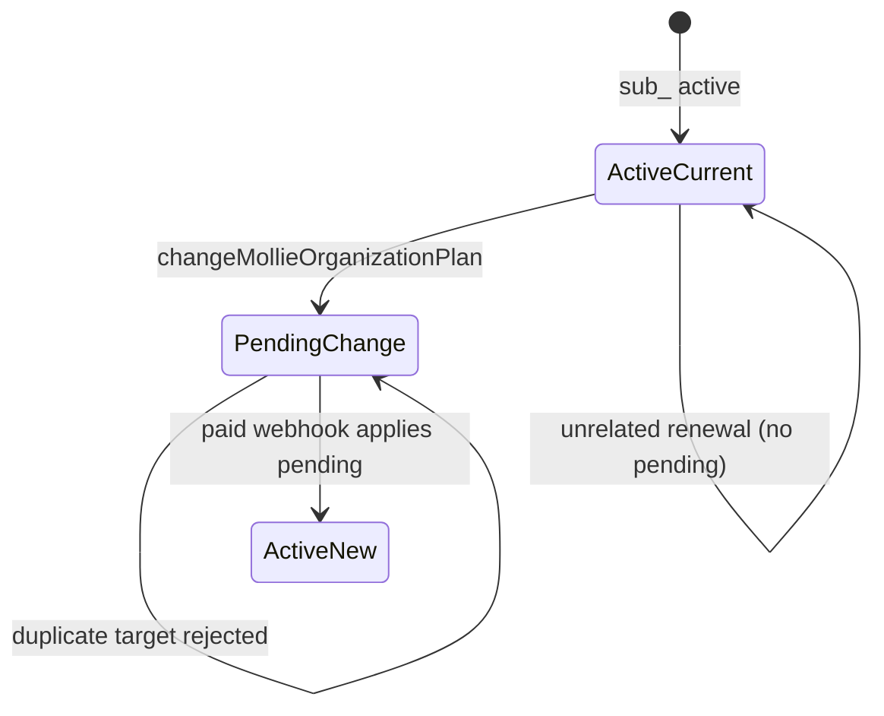

# Mollie Phase 4 — Final State Machine & Customer Communication

**Status:** Implemented at HEAD  
**Scope:** Mollie Professional ↔ Business plan-change lifecycle, authoritative billing state, UI, transactional email, idempotency, FastSpring coexistence, TEST/LIVE safety.

---

## A — Authoritative current vs pending plan

| Field | Role |
|-------|------|
| `provider_price_id` | **Authoritative current plan** — drives entitlements |
| `pending_plan` | Scheduled target — **not** entitlements until applied |
| `pending_plan_effective_at` | Informational effective date (Mollie `nextPaymentDate`) |
| `pending_plan_change_type` | `upgrade` \| `downgrade` |
| `provider_change_reference` | Mollie `sub_` id for idempotency keys |

**Rule:** Business remains current while Professional is pending on a scheduled downgrade. No optimistic entitlement switching.

---

## B — State machine



1. **Schedule:** `customerSubscriptions.update` + `scheduleMolliePendingPlanChange` — `provider_price_id` unchanged.
2. **Apply:** Paid webhook → `applyMolliePendingPlanChangeIfReady` flips `provider_price_id` and clears pending.
3. **Duplicate guard:** Same target → `This plan change is already scheduled.` Different target → conflict message.

---

## C — Centralized view model

- `src/lib/billing/plan-change.ts` — `resolveScheduledPlanChange`, `resolvePlanCardAction`, success/summary copy.
- `buildBillingOverview()` — exposes `scheduledPlanChange` on `BillingOverview`.
- Plans and billing UI consume overview fields — no duplicated pending-plan logic in components.

---

## D — Plans page UX (`/settings/plans`)

- **Current plan card:** green “Current Plan” badge.
- **Pending target card:** green “Downgrade scheduled” / “Upgrade scheduled” badge, effective date, disabled button.
- **Green success banner** after schedule and when a change is already pending.
- **No repeat downgrade** button on the scheduled target.

---

## E — Billing page UX (`/settings/billing`)

- Subscription summary includes scheduled plan change line.
- Dedicated **Scheduled plan change** section (green alert) when pending.
- Mollie cancel + Plans link unchanged; no portal theatre.

---

## F — Error mapping

| Backend | Customer message |
|---------|------------------|
| Same target already scheduled | `This plan change is already scheduled.` |
| Different pending change | `A different plan change is already scheduled…` |
| Current plan | `This is your organization's current plan.` |

Expected duplicates log `[billing][plan-change] request rejected` (info) — not fatal `[billing][checkout] failed`.

---

## G — Transactional email (scheduled)

- **Trigger:** Successful `changeMollieOrganizationPlan`.
- **Sender:** Auroranexis Notifications `<noreply@auroranexis.com>` via `sendTransactionalEmail`.
- **Category:** `billing_system`.
- **Idempotency:** `plan_change_scheduled:{sub_id}:{target_plan}` per `(user_id, template_key)`.
- **Failure policy:** Email failure does **not** roll back billing state.

---

## H — Transactional email (applied)

- **Trigger:** Webhook applies `pending_plan` → authoritative plan.
- **Separate template** from scheduled — “plan is now active”.
- **Idempotency:** `plan_change_applied:{sub_id}:{applied_plan}`.
- **Recipient:** Primary org owner (fallback: admin).

---

## I — Email templates

- `src/lib/email/templates/plan-change.ts` — branded HTML + plain text.
- Dynamic plan names and effective dates; links to `/settings/billing` and `/settings/plans`.

---

## J — Idempotency surfaces

| Surface | Mechanism |
|---------|-----------|
| Plan schedule API | DB `pending_plan` guard |
| Webhook apply | `mollie_webhook_events` ledger |
| Scheduled email | `transactional_email_deliveries` UNIQUE `(user_id, template_key)` |
| Applied email | Same ledger, distinct `plan_change_applied:*` key |

---

## K — Upgrade path (Pro → Business)

- Schedules pending; **does not** activate Business until paid webhook apply.
- Entitlements remain Professional until apply.

---

## L — Downgrade path (Business → Pro)

- No FastSpring portal redirect for Mollie.
- No immediate `provider_price_id` rewrite.
- UI shows Business as current, Professional as scheduled.

---

## M — Cancel scheduled change

**Not self-serve.** Mollie in-place amount update cannot be safely reversed without another provider API call and operator review. Billing UI documents: contact support to adjust before effective date.

---

## N — Authorization

- Plan changes: organization **owner/admin** only (`canManageOrganizationSettings`).
- Emails sent to acting user (schedule) or primary owner (apply).

---

## O — FastSpring coexistence

Unchanged. Mollie-owned orgs never fall through to FastSpring checkout. FastSpring rows refuse Mollie overwrite.

---

## P — TEST / LIVE safety

- `MOLLIE_LIVE_CHARGING_ENABLED=false` in `.env.example` — **not enabled** by this work.
- TEST credentials notice on plans page when applicable.

---

## Q — Database

Uses existing migration `20250822010000_mollie_pending_plan_change.sql`. No new migration required — email idempotency uses `transactional_email_deliveries` from `20250821100000_transactional_email_system.sql`.

---

## R — Logging

- `[billing][plan-change]` — schedule rejections, email failures (non-fatal).
- `[email][plan-change]` — send/skip/fail for transactional mail.

---

## S — Automated tests

`npm run test:mollie-billing` — Phase 4 suite categories A–AA including error mapping, UI contracts, email wiring, doc presence.

---

## T — Production gates

```bash
npm run lint
npm run typecheck
npm run test:mollie-billing
npm run test:fastspring-billing   # if present
npm run test:transactional-email-system
npm run build
```

---

## U — Manual test scenarios

### 1. Schedule downgrade (Business → Professional)
- Business = Current; Professional = “Downgrade scheduled” + date; green banner; email received.

### 2. Duplicate downgrade click
- Message: “This plan change is already scheduled.” — not “Unable to start checkout.”

### 3. Schedule upgrade (Professional → Business)
- Professional stays current; Business shows “Upgrade scheduled”; email received.

### 4. Webhook apply
- After simulated paid renewal: `provider_price_id` flips; pending cleared; “plan activated” email.

### 5. Billing page
- “Scheduled plan change” section matches DB pending fields.

### 6. Entitlements
- Before apply: features match **current** plan only.

### 7. FastSpring org regression
- FastSpring-owned org still blocked from Mollie checkout.

---

## V — 14 non-negotiable criteria

| # | Criterion | Status |
|---|-----------|--------|
| 1 | Current vs pending never confused | ✅ |
| 2 | Green success on schedule | ✅ |
| 3 | Dynamic copy with dates/plans | ✅ |
| 4 | Plans page scheduled state | ✅ |
| 5 | Billing scheduled section | ✅ |
| 6 | Centralized view model | ✅ |
| 7 | Duplicate error mapped | ✅ |
| 8 | Scheduled + applied emails | ✅ |
| 9 | Email idempotency | ✅ |
| 10 | Email failure non-blocking | ✅ |
| 11 | No premature upgrade entitlements | ✅ |
| 12 | FastSpring coexistence | ✅ |
| 13 | LIVE not enabled | ✅ |
| 14 | Tests + gates pass | ✅ (operator verify) |

---

## FINAL VERDICT

**READY FOR OPERATOR VERIFICATION** — Mollie plan-change state machine, UI, error mapping, and transactional notifications are implemented. Operators should run manual scenarios 1–7 in TEST mode before any LIVE promote.

**ONE next operator action:** Re-test duplicate downgrade on the live Business→Professional row; confirm UI shows “Downgrade scheduled” on Professional and duplicate click returns the specific message (not generic checkout error).
