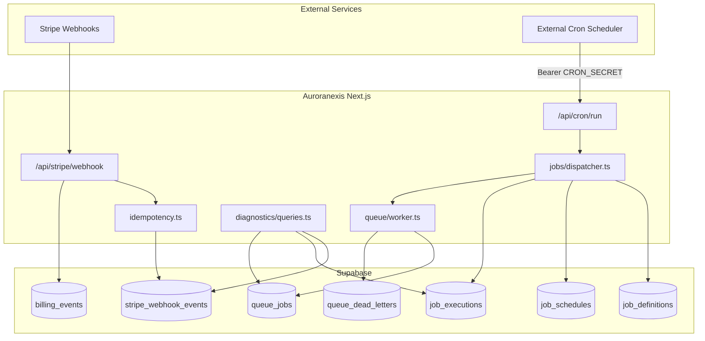

> **ARCHIVED (Build Bible V2 Chapter 14).** Use [enterprise-deployment.md](./enterprise-deployment.md), [enterprise-release-checklist.md](./enterprise-release-checklist.md), and [rollback-plan.md](./rollback-plan.md). Historical Stripe-era notes below are not authoritative.
# Production Infrastructure Report — Phase 5 Sprint 0

**Date:** 2025-06-27  
**Version:** v0.95  
**Sprint:** Phase 5 Sprint 0 — Production Infrastructure  
**Target:** Pilot / Production Infrastructure Ready

---

## Summary

Phase 5 Sprint 0 delivers the production infrastructure layer required to move Auroranexis from v0.9 RC ("external scheduler required") to v0.95 ("infrastructure ready for pilot"). Three coordinated subsystems — Stripe idempotency, cron jobs, and background queue — share Supabase persistence, service-role execution, authenticated HTTP dispatch, and unified diagnostics.

**Overall status:** Infrastructure implemented. Pilot-ready with documented operational requirements.

---

## Deliverables

| # | Deliverable | Location | Status |
|---|-------------|----------|--------|
| 1 | Database migration | `supabase/migrations/20250624140000_production_infrastructure.sql` | ✅ Complete |
| 2 | Stripe idempotency | `src/lib/stripe/idempotency.ts` | ✅ Complete |
| 3 | Webhook integration | `src/app/api/stripe/webhook/route.ts` | ✅ Complete |
| 4 | Job registry & scheduler | `src/lib/jobs/` | ✅ Complete |
| 5 | Cron HTTP endpoint | `src/app/api/cron/run/route.ts` | ✅ Complete |
| 6 | Queue system | `src/lib/queue/` | ✅ Complete |
| 7 | Diagnostics extensions | `src/lib/diagnostics/`, diagnostics panel | ✅ Complete |
| 8 | Operations documentation | `docs/*-checklist.md`, runbooks, reports | ✅ Complete |

---

## Architecture

---

## Subsystem summaries

### 1. Stripe webhook idempotency

- **Problem solved:** Duplicate Stripe deliveries caused inconsistent billing state (v0.9 gap).
- **Solution:** Event claim table + route-level dedup + billing_events unique constraint.
- **Detail:** [stripe-idempotency-report.md](./stripe-idempotency-report.md)

### 2. Cron job infrastructure

- **Problem solved:** No database-backed scheduler for reports, SLA, connectors (v0.9 gap).
- **Solution:** 8 registered jobs, execution audit, authenticated `/api/cron/run`.
- **Detail:** [cron-report.md](./cron-report.md)

### 3. Background queue

- **Problem solved:** No durable async processing with retry/dead-letter for heavy work.
- **Solution:** `queue_jobs` + exponential retry + dead letters + `queue_worker` cron.
- **Detail:** [queue-report.md](./queue-report.md)

### 4. Diagnostics & readiness scoring

- **Problem solved:** No visibility into infrastructure health for operators.
- **Solution:** Four new diagnostics sections + composite production readiness score.
- **Detail:** [diagnostics-report.md](./diagnostics-report.md)

---

## Database objects created

| Object | Type | Rows (seed) |
|--------|------|-------------|
| `stripe_webhook_events` | Table | 0 (runtime) |
| `idx_billing_events_stripe_event_unique` | Partial unique index | — |
| `job_definitions` | Table | 8 |
| `job_schedules` | Table | 8 |
| `job_executions` | Table | 0 (runtime) |
| `queue_jobs` | Table | 0 (runtime) |
| `queue_dead_letters` | Table | 0 (runtime) |

All tables: RLS enabled, service_role full access, owner/admin scoped SELECT where applicable.

---

## Security model

| Surface | Protection |
|---------|------------|
| Stripe webhook | Signature verification + idempotency |
| Cron endpoint | `CRON_SECRET` bearer (prod required) |
| Queue enqueue | Server-only (`dispatchQueueJob`) |
| Infrastructure tables | RLS + service role for workers |
| Diagnostics | Owner/admin session only |

---

## Validation summary

| Domain | Staging result | Reference |
|--------|----------------|-----------|
| Migration | ✅ Pass | [staging-report.md](./staging-report.md) |
| Stripe idempotency | ✅ Pass | [stripe-idempotency-report.md](./stripe-idempotency-report.md) |
| Cron dispatch | ✅ Pass | [cron-report.md](./cron-report.md) |
| Queue processing | ✅ Pass | [queue-report.md](./queue-report.md) |
| Diagnostics | ✅ Pass | [diagnostics-report.md](./diagnostics-report.md) |
| Build pipeline | ✅ Pass | typecheck, lint, build |

---

## Pilot readiness assessment

### Ready for pilot

- Stripe duplicate delivery protection
- Cron execution with audit trail
- Queue retry and dead-letter paths
- Operator diagnostics and readiness score
- Documented checklists, runbook, and disaster recovery

### Operator responsibilities (not code)

- Configure external cron scheduler (minimum every 5 minutes)
- Set production `CRON_SECRET` and rotate from staging
- Monitor diagnostics thresholds (failed webhooks, cron failures, queue dead letters)
- Complete [production-checklist.md](./production-checklist.md) before traffic

### Deferred to post-pilot

- Distributed job locking in cron dispatcher
- Full queue handler implementations for all job types
- Automated alerting integration (PagerDuty, etc.)
- Redis-backed API rate limiting (v0.9 item, unchanged)

---

## Version progression

| Version | Reliability score (v0.9 report) | Key gap |
|---------|----------------------------------|---------|
| v0.9 RC | 78/100 | No cron; Stripe idempotency gap |
| **v0.95** | **~88+ (projected)** | External scheduler wiring; queue handler completion |

---

## Recommendation

### **Pilot Ready — Production Infrastructure**

Auroranexis v0.95 is suitable for:

- **Pilot customers** with SLA expectations documented and cron scheduler monitored
- **Production deployment** after [production-checklist.md](./production-checklist.md) sign-off
- **Enterprise demos** with infrastructure diagnostics visible to owner/admin

Not yet **Enterprise Ready** until distributed locking, full queue handlers, and automated alerting are complete (overall score label requires ≥ 95).

---

## Related documentation

- [staging-checklist.md](./staging-checklist.md)
- [production-checklist.md](./production-checklist.md)
- [operations-runbook.md](./operations-runbook.md)
- [disaster-recovery.md](./disaster-recovery.md)
- [launch-readiness-report.md](./launch-readiness-report.md) (v0.9 baseline)

